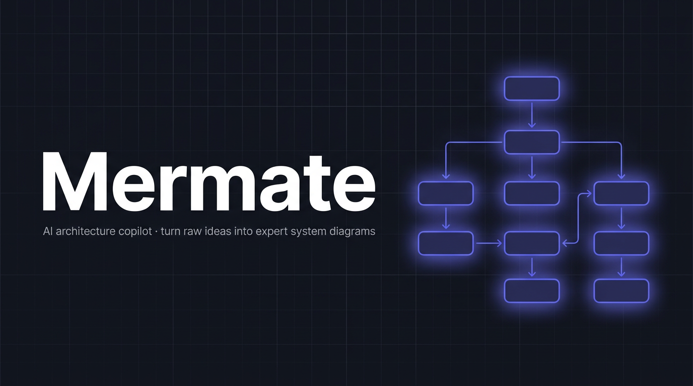

# Mermate

**AI architecture copilot for Mermaid, built to turn raw ideas into expert system diagrams.**

Describe a system in plain English. Mermate compiles it into production-quality Mermaid diagrams — flowcharts, state machines, sequence diagrams, ER diagrams, and more — with optional AI enhancement powered by whatever local or remote LLM you connect.

---

## Requirements

| Dependency | Version |
|---|---|
| Node.js | >= 20 |
| npm | >= 9 |
| Python | >= 3.9 (for gpt-oss enhancer, optional) |

Mermate ships **without an AI model**. It is a diagram compilation engine with a copilot layer. You bring the model.

---

## Verified local architecture

This repo is now being used as a sidecar for the local OpenClaw desktop wrapper in:

- `/Users/dylanckawalec/Desktop/developer/dylans_nemoclaw`

Current local architecture:

- OpenClaw Desktop Console: chat UI + OpenShell bridge on `http://127.0.0.1:8787`
- NemoClaw/OpenShell: managed sandbox execution inside `aoc-local`
- Ollama: local inference on `http://127.0.0.1:11434`
- Mermate: idea -> markdown -> Mermaid -> TLA+ -> TypeScript sidecar on `http://127.0.0.1:3333`
- Claude Code: attached through MCP with both project `.mcp.json` and a local plugin marketplace entry

The wrapper currently uses Mermate as the architecture and formalization surface, not as the primary chat transport.

## Verified model reality on this machine

Observed on March 26, 2026:

- Local Ollama `gpt-oss:20b`: working
- Local Ollama `nemotron-3-nano:4b`: working
- Local Ollama `kimi-k2.5:cloud`: listed by Ollama, but direct chat currently returns `unauthorized`
- Managed `inference.local` route: currently advertises `kimi-k2.5:cloud`, `nemotron-3-nano:4b`, and `gpt-oss:20b`
- Managed-route requests for `kimi-k2.5:cloud`: currently resolve back to `nemotron-3-nano:4b`

Important caveat:

- The managed route can resolve to a different actual model than the requested one, so any wrapper should trust the response `model` field over the request payload.

---

## Quick start

```bash
# 1. Clone into your developer folder
git clone <your-fork-or-repo> ~/developer/mermaid
cd ~/developer/mermaid

# 2. Install dependencies
npm install

# 3. Create your local env
cp .env.example .env

# 4. Start the app
./mermaid.sh start
```

Open [http://localhost:3333](http://localhost:3333).

That's it. The app runs completely without an AI model. You can paste Mermaid source directly and compile it to high-resolution PNG and SVG from day one.

### If startup fails on DuckDB

On this machine, the first Mermate restart failed because the native DuckDB binding was missing under `node_modules/duckdb/lib/binding/duckdb.node`.

Rebuild it with:

```bash
cd /Users/dylanckawalec/Desktop/developer/mermaid
npm rebuild duckdb
```

If you are on a different Node major, prefer rebuilding after any Node upgrade so the native binding matches the active runtime.

---

## Local `.env` setup for agent use

The agent workflow, premium render path, and Max mode are configured from your local `.env`.

Start with:

```bash
cp .env.example .env
```

Recommended `.env` for the OpenAI API path:

```env
MERMATE_AI_API_KEY=your_openai_api_key
MERMATE_AI_PROVIDER=openai
MERMATE_AI_MODEL=gpt-4o-mini
MERMATE_AI_MAX_MODEL=gpt-4o
MERMATE_AI_MAX_ENABLED=true
```

What these do:

- `MERMATE_AI_API_KEY`: enables the premium API provider
- `MERMATE_AI_PROVIDER`: premium provider selector; `openai` is the default and recommended option
- `MERMATE_AI_MODEL`: default premium model used for normal AI renders
- `MERMATE_AI_MAX_MODEL`: stronger premium model used when Max mode is enabled
- `MERMATE_AI_MAX_ENABLED`: turns Max mode on in the runtime provider layer

Recommended starting setup:

- Use `openai` for the premium provider
- Keep `gpt-4o-mini` as the default model for cheaper iteration
- Use `gpt-4o` as the Max model for final architect-grade renders
- Leave local Ollama or the Python enhancer optional unless you specifically want a local-first workflow

Optional local providers:

```env
MERMATE_OLLAMA_URL=http://localhost:11434
MERMATE_OLLAMA_MODEL=gpt-oss:20b
MERMAID_ENHANCER_URL=http://localhost:8100
MERMAID_ENHANCER_TIMEOUT=15000
```

Provider behavior in the app today:

- Copilot suggestions and text enhancement prefer local-first fallback: Ollama -> Python enhancer -> premium API
- Render preparation prefers the strongest available provider path, with premium API first
- Max mode uses `MERMATE_AI_MAX_MODEL` when `MERMATE_AI_MAX_ENABLED=true`
- If no AI provider is available, the app still works as a Mermaid compiler with local suggestion fallbacks

---

## What you get without an AI model

- Paste Mermaid source → compile to PNG + SVG
- Auto-detection of diagram type (flowchart, sequence, state, ER, gantt, pie, mindmap, etc.)
- Axiomatic pre-compile validation
- Download both outputs as a ZIP
- Fullscreen canvas view with GPU-accelerated pan/zoom
- Diagram history with delete support
- `./mermaid.sh compile <file.mmd>` to compile any `.mmd` file from the command line
- `./mermaid.sh validate` to validate all archived diagrams against structural rules

---

## Connecting an AI model

Mermate supports three AI paths:

- Premium API provider configured from `.env` (`openai` recommended)
- Local Ollama provider for cheap local iteration
- Python enhancer bridge on `http://localhost:8100`

The app automatically uses the best available provider chain for the current action. If one provider is offline, Mermate falls through to the next available option.

### Recommended setup: OpenAI API

If you want the simplest and highest-quality agent setup, use the premium API path:

```env
MERMATE_AI_API_KEY=your_openai_api_key
MERMATE_AI_PROVIDER=openai
MERMATE_AI_MODEL=gpt-4o-mini
MERMATE_AI_MAX_MODEL=gpt-4o
MERMATE_AI_MAX_ENABLED=true
```

This enables:

- `Enhance` for architecture text refinement
- stronger text-to-Mermaid conversion during render
- Max mode for final higher-quality architecture output
- the staged agent workflow that pauses on a preview render before the final Max pass

### Local OpenClaw wrapper integration

The desktop wrapper can attach to Mermate through MCP tools and direct HTTP calls.

Verified wrapper-facing surfaces in this repo:

- `GET /api/copilot/health`
- `POST /api/render`
- `GET /api/render/tla/status`
- `POST /api/render/tla`
- `GET /api/render/ts/status`
- `POST /api/render/ts`
- `GET /api/agent/modes`

That means the wrapper can use Mermate for:

- idea -> markdown -> Mermaid compilation
- Mermaid -> TLA+ formalization
- TLA+ -> TypeScript runtime generation
- mode discovery for code review, thinking, optimize, TLA verify, and TS generation flows

If you want Claude Code to drive those surfaces through the wrapper instead of calling this repo directly, use the OpenClaw desktop plugin and MCP server from `/Users/dylanckawalec/Desktop/developer/dylans_nemoclaw`.

### Optional setup: local enhancer contract

Any model server that accepts `POST /mermaid/enhance` works.

#### What the enhancer endpoint expects

```
POST http://localhost:8100/mermaid/enhance
Content-Type: application/json

{
  "stage": "text_to_md" | "md_to_mmd" | "validate_mmd" | "repair" |
           "copilot_suggest" | "copilot_enhance",
  "raw_source": "user input text",
  "system_prompt": "injected axiom prompt from Mermate",
  "temperature": 0.0
}
```

```
Response:
{
  "enhanced_source": "...",   // for diagram stages
  "suggestion": "...",        // for copilot_suggest
  "confidence": "high",       // for copilot_suggest
  "transformation": "..."
}
```

Mermate sends a full system prompt with each call (built from `archs/mermaid_axioms.md`). Your model only needs to follow the system prompt and return valid JSON.

---

## Example: using gpt-oss-20b

> This is one approach. You are free to use any model that fits the endpoint contract above.

### Step 1 — Check if you have gpt-oss-20b

```bash
# If you are using Ollama
ollama list | grep gpt-oss

# If you are using a local server
ls ~/models/ | grep gpt-oss
```

If nothing shows up, continue to Step 2. If it's already there, jump to Step 4.

### Step 2 — Download gpt-oss-20b

```bash
# Via Ollama (simplest path)
ollama pull gpt-oss-20b

# Or download GGUF weights manually and load with llama.cpp / LM Studio
# Model page: https://huggingface.co/gpt-oss-20b (placeholder — use your actual model source)
```

### Step 3 — Start the model server on port 8100

```bash
# With Ollama
OLLAMA_HOST=0.0.0.0:8100 ollama serve

# Or with llama-cpp-python
python3 -m llama_cpp.server --model ~/models/gpt-oss-20b.gguf --port 8100

# Or with LM Studio: start the server, set port to 8100, and add a proxy route
# that maps POST /mermaid/enhance to the completion endpoint.
```

### Step 4 — Point Mermate at your model

By default Mermate looks for the enhancer at `http://localhost:8100`. If your server runs on a different host or port:

```bash
# Mermate reads this environment variable
MERMAID_ENHANCER_URL=http://localhost:11434 ./mermaid.sh start

# Or to auto-start the enhancer via mermaid.sh
MERMAID_ENHANCER_START_CMD="ollama serve" ./mermaid.sh start
```

### Step 5 — Verify the connection

```bash
curl http://localhost:8100/health
# Expected: 200 OK
```

When the enhancer is healthy, the app shows "Enhancer: healthy" on startup and the `Enhance` checkbox becomes active.

### Kimi 2.5 note

Kimi can fit in two ways, but the current local state matters:

- If Ollama cloud auth is configured, Mermate can target `kimi-k2.5:cloud` through the existing Ollama path by setting `MERMATE_OLLAMA_MODEL=kimi-k2.5:cloud`
- If you want to use Kimi through an OpenAI-compatible remote API, that needs a premium-provider base-url path that is not currently configurable in `server/services/inference-provider.js`

So on this machine right now, Kimi is discoverable but not yet usable through either the local Ollama path or the managed NemoClaw route.

---

## What to do next

Once the app is running, here are the starting prompts to try:

**Simple architecture idea:**
```
A user logs in via the browser, the API gateway validates the JWT,
then routes to the user service which reads from PostgreSQL.
On failure, return 401 to the browser.
```

**Event-driven system:**
```
Payment service emits OrderCreated event to Kafka.
Inventory service and notification service both consume it.
If inventory fails, route to dead letter queue.
```

**State machine:**
```
Pod lifecycle: Pending → ContainerCreating → Running.
On OOM kill → Failed. On graceful shutdown → Succeeded.
```

**CI/CD pipeline:**
```
Code push triggers build, then parallel unit tests and lint,
then integration tests, security scan, staging deploy,
manual approval gate, then canary production deploy at 5% → 25% → 100%.
```

Paste any of these into Simple Idea mode and press **Render**. Add `Enhance` for AI-assisted refinement.

---

## Agent mode

The app now includes an agent workflow for iterative architecture refinement.

### What the agent does

The frontend agent UI calls two SSE endpoints:

- `POST /api/agent/run`: ingest -> planning -> refinement -> preview render -> pause for notes
- `POST /api/agent/finalize`: optional note incorporation -> final Max render

There is also:

- `GET /api/agent/modes`: returns the available agent modes and labels

### Available agent modes

- `thinking`: build architecture from ideas, notes, or problem statements
- `code-review`: recover architecture from an existing codebase
- `optimize-mmd`: improve existing Mermaid or markdown without breaking intent

### How prompting behavior is controlled

The route layer loads mode instructions from `.cursor/assets`:

- `.cursor/assets/THINKING-MODE.txt`
- `.cursor/assets/CODE-REVIEW-MODE.txt`
- `.cursor/assets/OPTIMIZE-MMD-MODE.txt`

Those mode files are injected into the system prompt used by `server/routes/agent.js`, which tells the model to:

- preserve what the user already specified
- produce improved architecture text, not Mermaid
- add structure, flows, boundaries, and failure handling
- pause after a preview render so the user can steer the final Max render

### Agent guidance inside `.cursor`

The project also includes Cursor-facing guidance for architecture work:

- `.cursor/agent-architect/SKILL.md`: the skill tree and operating philosophy for iterative architecture work
- `.cursor/agent-architect/OPERATING_PROCEDURE.md`: runtime guidance, provider order, render rhythm, and evaluation rules
- `.cursor/agents/openai.yaml`: the Cursor agent definition for the OpenAI-backed architecture agent

Together, these files act as the project's prompt and behavior layer for the architecture agent experience.

### Local AI scripts (`.cursor/scripts`)

The `.cursor/scripts/` directory contains Python modules for a **local AI enhancer extension**. These scripts are **not meant to be run from this repo**. They are reference implementations for an LLM extension you should host in a **separate top-level directory** (e.g. `gpt_oss/extensions/mermaid_enhancer/` or your LLM framework's extension path). Copy or symlink them into your local AI project and run the enhancer service there. Mermate connects to it via `MERMAID_ENHANCER_URL` when the service is running.

---

## Route overview

The route layer is split into two files mounted under `/api` in `server/index.js`.

### `server/routes/render.js`

Handles the main app workflow:

- `GET /api/copilot/health`: provider availability and Max readiness
- `POST /api/analyze`: input profile analysis without rendering
- `POST /api/copilot/enhance`: copilot suggestion/enhancement proxy
- `POST /api/render`: full analysis -> transform -> compile -> archive pipeline
- `GET /api/diagrams`: list saved diagram outputs
- `DELETE /api/diagrams/:name`: remove compiled artifacts and archived source

This is the core production path for the app. It decides whether to route through premium API, Ollama, the enhancer bridge, or non-AI compile paths.

### `server/routes/agent.js`

Handles the staged architecture-agent workflow:

- loads prompt skeletons from `.cursor/assets`
- analyzes the current draft with `input-analyzer`
- calls the inference provider for planning and refinement
- performs a preview render through `/api/render`
- pauses for user notes before triggering the final Max render

This route makes Mermate more than a one-shot Mermaid compiler: it turns the app into a review-and-refine architecture copilot.

---

## Project structure (brief)

```
mermaid/
├── mermaid.sh              # Start, compile, validate
├── server/                 # Express API (port 3333)
│   ├── routes/render.js    # Analyze, enhance, render, list, and delete diagrams
│   ├── routes/agent.js     # Agent planning, preview, and finalize flows
│   └── services/
│       ├── mermaid-compiler.js    # mmdc wrapper, high-res PNG/SVG
│       ├── mermaid-classifier.js  # Diagram type detection
│       ├── input-detector.js      # Content-state detection (text/md/mmd/hybrid)
│       ├── input-router.js        # Pipeline routing
│       ├── diagram-selector.js    # Axiom-based diagram type selection
│       ├── mermaid-validator.js   # Pre-compile structural validation
│       ├── axiom-prompts.js       # System prompts for each pipeline stage
│       ├── inference-provider.js  # Premium API, Ollama, enhancer provider chain
│       └── gpt-enhancer-bridge.js # HTTP bridge to the enhancer service
├── public/                 # Frontend (served statically)
│   ├── js/mermaid-gpt-copilot.js  # Ghost-text copilot for Simple Idea mode
│   ├── js/mermaid-gpt-agent.js    # Frontend agent orchestration and SSE handling
│   └── css/mermaid-gpt.css
├── .cursor/
│   ├── assets/             # Mode prompt skeletons used by /api/agent/*
│   ├── agents/openai.yaml  # Cursor agent definition
│   └── agent-architect/    # Skill + operating procedure for architecture work
├── archs/                  # Archived diagram sources (.mmd, .md)
│   └── flows/              # Compiled output from ./mermaid.sh compile
├── flows/                  # Compiled output from the web app (served at /flows)
├── test/                   # Node test suite
└── archs/mermaid_axioms.md # The intelligence model (read this)
```

---

## The intelligence model

The axioms that govern how Mermate thinks about diagrams live in `archs/mermaid_axioms.md`. This is the most important file to read if you want to:

- Fine-tune your own model against Mermate's prompts
- Extend the enhancer with custom stages
- Build your own `gpt-oss` extension for Mermate

**The key design principle:** Mermate ships the reasoning framework. You supply the model. The combination is what makes it powerful.

---

## Choosing a model and thinking about fine-tuning

Mermate does not mandate a specific model. These are the questions worth considering:

**Model size tradeoffs**
- 7B–13B models: fast, local-friendly, good for `validate_mmd` and `copilot_suggest`
- 20B–34B models: better at `text_to_md` and `copilot_enhance` (more architectural reasoning)
- 70B+ models: best for complex architecture generation and AAD-style decomposition

**Fine-tuning targets**
The prompts in `server/services/axiom-prompts.js` are the system prompts Mermate injects. If you fine-tune a model on pairs of (axiom_prompt, mermaid_source), you get a model that follows the axiom framework natively without needing the full prompt injection.

**What to build in your gpt-oss extension**
The enhancer endpoint receives a `stage` field. You can add your own stages — for example, a `validate_architecture` stage that checks if the described system is secure, or a `suggest_diagram_type` stage that proposes the best visualization for a given input. Mermate's router will call whatever stages you support.

---

## CLI reference

```bash
./mermaid.sh start                          # Start the web app
./mermaid.sh compile                        # Compile all .mmd files in archs/
./mermaid.sh compile <filename.mmd>         # Compile one file
./mermaid.sh validate                       # Validate all .mmd files against axiom rules
./mermaid.sh test                           # Run the test suite
```

Environment variables:

```bash
PORT=3333                                   # App server port (default 3333)
MERMATE_AI_API_KEY=<key>                    # Premium provider API key
MERMATE_AI_PROVIDER=openai                  # Premium provider (recommended)
MERMATE_AI_MODEL=gpt-4o-mini                # Default premium model
MERMATE_AI_MAX_MODEL=gpt-4o                 # Stronger model used by Max mode
MERMATE_AI_MAX_ENABLED=true                 # Enable Max mode
MERMATE_OLLAMA_URL=http://localhost:11434   # Optional Ollama base URL
MERMATE_OLLAMA_MODEL=gpt-oss:20b            # Optional Ollama model
MERMAID_ENHANCER_URL=http://localhost:8100  # Enhancer service URL
MERMAID_ENHANCER_TIMEOUT=15000              # Enhancer request timeout in ms
MERMAID_ENHANCER_START_CMD="<command>"      # Auto-start command for the enhancer
```

---

## ⚠️ Important

Mermate does not ship an AI model. The copilot and enhancement features are designed to work with a model you choose and run. The quality of the AI output depends entirely on your model. Mermate's job is to provide excellent system prompts, a structured reasoning pipeline, and a clean compilation layer. Your model's job is to follow the prompts.

If you run Mermate without any model connected, it functions as a standalone Mermaid compiler and is fully usable for direct diagram authoring.
