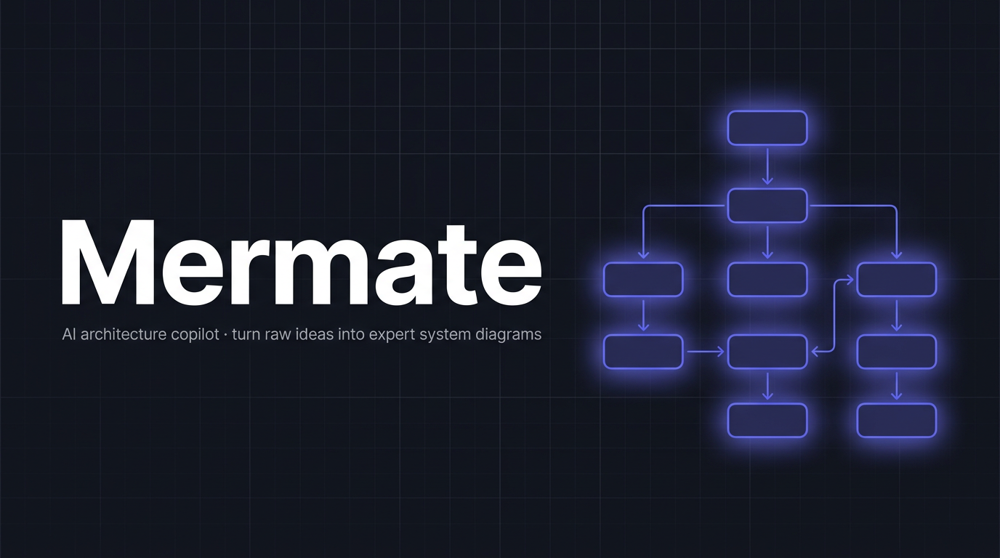
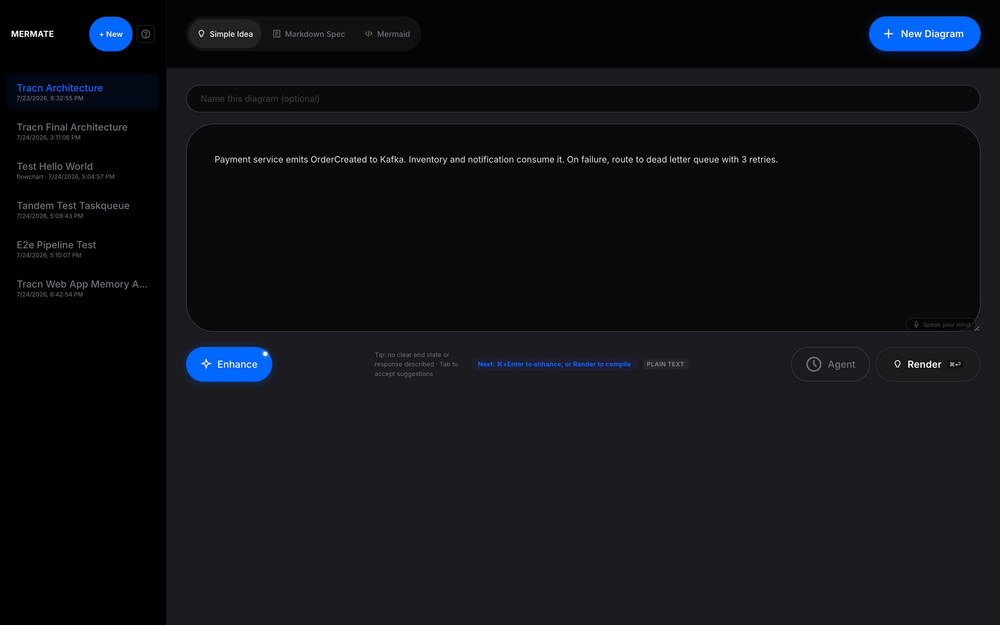

# Mermate

**AI architecture copilot for Mermaid — raw ideas in, verified systems out.**


Describe a system in plain English. Mermate compiles it into production-quality Mermaid diagrams — flowcharts, state machines, sequence diagrams, ER diagrams, and more — then keeps going: **idea → Markdown spec → Mermaid → TLA+ specification → TypeScript runtime → downloadable bundle**.

Mermate ships **without an AI model**. It is a compilation engine with a copilot layer — you bring the model (OpenAI-compatible API, local Ollama, or any endpoint that speaks the enhancer contract). With no model connected it still works as a full Mermaid compiler.





---

## Quick start

```bash
git clone <your-fork-or-repo> ~/developer/mermaid
cd ~/developer/mermaid
npm install
cp .env.example .env     # optional — only needed for AI features
./mermaid.sh start
```

Open [http://localhost:3333](http://localhost:3333). That's it.

**Requirements:** Node.js ≥ 20, npm ≥ 9. Python ≥ 3.9 only if you run the optional local enhancer.

**Try these first prompts** (paste into *Simple Idea*, press **Render**):

```
Payment service emits OrderCreated event to Kafka.
Inventory service and notification service both consume it.
If inventory fails, route to dead letter queue.
```

```
Pod lifecycle: Pending → ContainerCreating → Running.
On OOM kill → Failed. On graceful shutdown → Succeeded.
```

---

## What you get

| Capability | Model needed? |
|---|---|
| Paste Mermaid → high-res PNG + SVG, auto diagram-type detection, ZIP download | No |
| Pre-compile structural validation, fullscreen GPU pan/zoom canvas, diagram history | No |
| **Enhance** — ghost-text copilot + full-text refinement of your idea | Yes |
| Text → Mermaid compilation with repair budgets | Yes |
| **Agent mode** — staged planning → preview render → your notes → final render, over SSE | Yes |
| **TLA+ specification** generated from your diagram, SANY-parsed and TLC-checked | Yes (+ Java for TLC) |
| **TypeScript runtime** compiled from the verified TLA+ artifact, tested | Yes |
| Run lineage: every LLM call audited, per-stage cost/token summaries, trace JSON | No |
| Optional Rust binary + macOS `.app` packaging with landing page | Yes |

### The winning design (formally verified)

The session control plane — tab FSM, agent pipeline, verification gate,
persistence — is specified in TLA+ and model-checked clean:
**992,588 states explored, no errors**, termination and verify-response
liveness proven.



The four enforced invariants, each guarding a real past regression:

- **TS exists only behind verified TLA+** — TypeScript unlocks exactly when SANY passes, never on render alone
- **No silent data loss** — every mutation is synchronously durable, or you are told (sticky storage alarm)
- **Verification fires only on explicit authorization** — never on tab switch
- **Enhance never empties content** — presence-preserving by contract

Spec: [`docs/specs/MermateOrchestrator.tla`](docs/specs/MermateOrchestrator.tla) ·
Implementation plan: [`plan.md`](plan.md) ·
Regression tests: `test/test-winning-design.js` (one test per invariant)

Re-verify the spec:

```bash
cd docs/specs
java -XX:+UseParallelGC -cp ../../vendor/tla2tools.jar tlc2.TLC \
  -workers 4 -config MermateOrchestrator.cfg MermateOrchestrator.tla
```

---

## Connecting a model

Three provider paths, automatically chained with fallback — if one is offline, Mermate falls through to the next:

| Provider | Configure | Best for |
|---|---|---|
| OpenAI-compatible API | `OPENAI_API_KEY` (+ optional `OPENAI_BASE_URL`) | Highest quality (default tiers: `gpt-5.6-sol` orchestrator, `gpt-5.6-terra` worker, `gpt-5.6-luna` fast) |
| Local Ollama | `MERMATE_OLLAMA_URL`, `MERMATE_OLLAMA_MODEL` | Free local iteration |
| Python enhancer | `MERMAID_ENHANCER_URL` (any server accepting `POST /mermaid/enhance`) | Custom/self-hosted models |

Minimal `.env` for the hosted path:

```env
OPENAI_API_KEY=sk-proj-YOUR_KEY_HERE
# Optional overrides — defaults are already sensible:
# MERMATE_ORCHESTRATOR_MODEL=gpt-5.6-sol
# MERMATE_WORKER_MODEL=gpt-5.6-terra
# MERMATE_FAST_STRUCTURED_MODEL=gpt-5.6-luna
# CLAUDE_API_KEY=sk-ant-...          # Anthropic for TLA+ authoring
```

The enhancer contract is one endpoint: Mermate POSTs `{ stage, raw_source, system_prompt, temperature }` and expects `{ enhanced_source }` (or `{ suggestion }` for copilot stages). Any model server that honors it works — see `archs/mermaid_axioms.md` for the prompt framework it plugs into.

> Routing inference through an **Opseeq** gateway? All Opseeq-specific notes (URL rules, model aliasing caveats, fallback events, trace correlation, WS telemetry) live in **[docs/opseeq.md](docs/opseeq.md)**.

---

## Agent mode

The agent turns Mermate from a one-shot compiler into a review-and-refine copilot. It plans from your draft, produces a **preview render**, pauses for your notes, then runs the final render — streaming narration over SSE. Agent runs survive page refresh (reattach to live sessions; completed runs recover their artifacts on boot).

Modes: `thinking` · `code-review` · `optimize-mmd` · `tla-verify` · `tla-optimize` · `ts-generate` · `ts-optimize` · `full-build`

Every LLM call, repair attempt, and stage transition emits an audit event. Repair calls are budgeted per stage (`MERMATE_MAX_REPAIR_CALLS`, default 5) with graceful failure.

Idle discipline: when nothing is running and you haven't interacted for 60s, the app makes **zero** API calls.

---

## Docs

| Doc | Contents |
|---|---|
| [docs/MERMATE-PRODUCT-SPECIFICATION.md](docs/MERMATE-PRODUCT-SPECIFICATION.md) | Full product specification |
| [docs/specs/MermateOrchestrator.tla](docs/specs/MermateOrchestrator.tla) | The winning control-plane design (TLC-verified) |
| [plan.md](plan.md) | Winning-design implementation plan + findings |
| [docs/specula-integration.md](docs/specula-integration.md) | Specula engine + TLA+ artifact layout |
| [docs/opseeq.md](docs/opseeq.md) | All Opseeq gateway notes |
| [docs/tandem-opseeq-protocol.md](docs/tandem-opseeq-protocol.md) | MERMATE ↔ Opseeq correlation protocol |
| [docs/adr/0001-pipeline-ports-and-adapters.md](docs/adr/0001-pipeline-ports-and-adapters.md) | Architecture decision record |
| [archs/mermaid_axioms.md](archs/mermaid_axioms.md) | **The intelligence model — read this to extend Mermate** |

---

## CLI reference

```bash
./mermaid.sh start                  # Start the web app (port 3333)
./mermaid.sh compile <file.mmd>     # Compile one diagram from the CLI
./mermaid.sh compile                # Compile everything in archs/
./mermaid.sh validate               # Validate archived diagrams
./mermaid.sh test                   # Run the test suite
```

Key environment variables (full list in `.env.example`):

```bash
PORT=3333                                # App server port
OPENAI_API_KEY=<key>                     # Hosted-model key
CLAUDE_API_KEY=<key>                     # Anthropic (TLA+ authoring)
MERMATE_OLLAMA_URL=http://localhost:11434
MERMAID_ENHANCER_URL=http://localhost:8100
MERMATE_MAX_REPAIR_CALLS=5               # Repair budget per stage
MERMATE_DUMP_DIR=~/Desktop/MERMATE/dumps # Optional completed-run exports
```

## Project structure (brief)

```
mermaid/
├── mermaid.sh               # Start, compile, validate, test
├── server/                  # Express API (port 3333)
│   ├── routes/              # render, agent, tla, ts, runs, bundle, artifacts, …
│   └── services/            # compiler, classifier, inference-provider,
│                            # run-tracker, audit-tracker, specula bridges, …
├── public/                  # Frontend (static) — app, copilot, agent SSE client
├── docs/                    # Specs, Opseeq notes, ADR, images
├── .windsurf/skills/        # Agent skill tree (specification-master-agent + TLA+ skills)
├── specula-engine/          # Specula TLA+ engine (git submodule)
├── archs/                   # Archived diagram sources + mermaid_axioms.md
├── flows/                   # Compiled outputs (served at /flows)
└── runs/                    # Run JSON + trace lineage (served at /runs)
```

---

## Troubleshooting

**Startup fails on DuckDB native binding** → `npm rebuild duckdb` (repeat after any Node major upgrade).

**Enhance/Render does nothing** → no model configured; the app still compiles pasted Mermaid. Check `GET /api/copilot/health`.

**TLA+ stage reports toolchain missing** → TLC needs Java + `vendor/tla2tools.jar` (bundled) or the Specula engine setup; see [docs/specula-integration.md](docs/specula-integration.md).

---

## ⚠️ Important

Mermate does not ship an AI model. The copilot, enhancement, agent, and formal-spec features work with a model **you** choose and run. Output quality depends on your model; Mermate's job is excellent system prompts, a structured reasoning pipeline, a verified control plane, and a clean compilation layer.

Run it without any model and it is a fully usable standalone Mermaid compiler.
