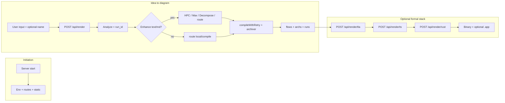

# Mermate (Mermaid-GPT) — Product & System Behavior Specification

**Document type:** End-to-end temporal logic and capability specification  
**Scope:** Implemented behavior only (no roadmap unless labeled non-current)  
**System:** Local Node.js application (`server/index.js`), static web UI (`public/`), artifact stores (`archs/`, `flows/`, `runs/`), optional toolchains (TLA+, TypeScript, Rust, Opseeq, MCP)

---

## Executive summary

Mermate is an **AI-assisted Mermaid compilation engine** with a **staged formal pipeline**: natural language or diagram source → validated Mermaid → raster/vector renders → optional TLA+ specification → optional TypeScript runtime → optional **Rust native binary** and **macOS `.app` bundle** (when the host has the Rust toolchain and is on macOS).

The **earliest initiation event** is either:

1. **Operator starts the server** (`./mermaid.sh start` or `npm start`), which loads environment, mounts HTTP APIs, serves the web UI, and runs background hooks (run retention, optional meta-cognition cron), or  
2. **User opens the web UI** and interacts with inputs, or  
3. **External client** calls HTTP or MCP endpoints against the running server.

The **final compiled outcome** for the diagram path is **high-resolution PNG and SVG** under `flows/<diagram-name>/`, plus archived sources under `archs/`. The **final binary outcome** for the full formal stack is a **Rust release binary** at `flows/<name>-<runSuffix>/rust-binary/target/release/<binary>` and, on success with packaging, a **macOS application bundle** `<binary>.app` (and optional copy to the user Desktop).

---

## 1. End-to-end sequential behavior

### 1.1 Cold start and process lifecycle

| Order | Event | Behavior |
|------|--------|----------|
| 1 | Process launch | Node loads `.env` (two-pass: assign values, then resolve `{VAR}` placeholders). |
| 2 | Express app construction | JSON body limit 2MB; static routes for `public/`, `/flows`, `/archs`, `/runs`, vendor `three`. |
| 3 | Foundation services | `got-config`, `role-registry`, `agent-loader` initialized (config errors surface early). |
| 4 | API routers mounted | All routes share prefix `/api` (render, agent, transcribe, tla, ts, tsx, search, openclaw, bundle, guide, artifacts, rust, trace). |
| 5 | Housekeeping | `run-tracker.cleanup` and `run-exporter.cleanup` run asynchronously. |
| 6 | HTTP listen | Default port `3333` (override `PORT`). |
| 7 | Background (optional) | If `META_GATEWAY_ENABLED !== 'false'`, interval `META_CRON_INTERVAL_MS` (default 5 minutes) calls meta-gateway `cronOptimize`. |
| 8 | Shutdown | `SIGTERM`/`SIGINT`: clear meta timer, `rate-master-bridge.destroy`, close server. |

### 1.2 User session: “new diagram” and naming

| Order | Event | Behavior |
|------|--------|----------|
| 1 | **New diagram** (UI) | Clears textarea and optional diagram name input, hides results, resets pan/zoom, clears `currentRunId` / `currentDiagramName`, resets `WorkflowOrchestrator` session state, may prompt for name via sidebar pending callback. |
| 2 | **Diagram name** | Optional field `diagram-name-input`. If provided on render, `deriveDiagramName` uses it (slugified); otherwise name is derived from subgraph title, first node label, text summary, or `diagram-<timestamp>`. |
| 3 | **Structure initialization** | No separate “project file” database: the **first persistent write** for a render is creation of `runs/<uuid>.json` (run tracker) plus parallel archive/compile writes (see §1.3). |

### 1.3 Primary render path: `POST /api/render`

This is the **core chronological pipeline** for turning input into diagrams and canonical artifacts.

| Phase | Step | Description |
|-------|------|-------------|
| **A** | Request validation | Requires non-empty `mermaid_source`; max 100k chars. |
| **B** | Input analysis | `input-analyzer.analyze` produces profile: content state (text/md/mmd/hybrid), maturity, quality, shadow entities/relationships, decomposition hints. |
| **C** | Run creation | `run-tracker.create` writes `runs/<run_id>.json` with settings, request snapshot, empty `agent_calls`, etc. Profile stored on manifest. |
| **D** | Optional early fact extraction | If content is text/md **and** Enhance is on **and** shadow has ≥2 entities: `provider.infer('fact_extraction', …)` to enrich run lineage (best-effort JSON parse). |
| **E** | Pipeline selection (Enhance + text/md only) | Chooses among: **decompose** (very complex), **max_upgrade** (`max_mode` and Max available), **hpc_got** (default for non-trivial entity count), **render_prepare** (small/trivial cases). If not using provider-backed branch, falls through to `route()` (§2.2). |
| **F** | Provider-backed pipelines (when applicable) | See §2.2 and §3. Output: final `.mmd` string + metadata. |
| **G** | Diagram naming | `deriveDiagramName(mmdSource, diagram_name)`. |
| **H** | Parallel persistence | **Archive** original story + mmd to `archs/`; **compile** to `flows/<name>/` via `compileWithRetry`. |
| **I** | Compile retry semantics | Attempt 1: `mmdc`; 2: deterministic repair + compile; 3: model repair + deterministic repair + compile. Failure → HTTP 422, run finalized `failed`, Opseeq stage `render_failed`. |
| **J** | Post-compile | Subviews moved into `flows/.../subviews/` if present; canonical **`architecture.md`** written; `archiveCompiled` writes `archs/<name>.compiled.mmd`; optional **visual** asset if `visual` flag and visual provider available. |
| **K** | Validation metrics | Post-render `mermaid-validator`, SVG/PNG validity/size metrics. |
| **L** | Run finalization | `runTracker.setFinalArtifact`, Opseeq `render_complete`, `finalize(completed)`. |
| **M** | HTTP response | Paths to PNG/SVG/mmd/md/architecture, `run_id`, `progressionUpdate` (unlocks downstream stages in API contract), optional `fallback_events` from inference provider. |

### 1.4 Downstream formal stages (same `run_id`)

These stages **depend on** a completed render that populated run JSON and artifacts. They are invoked by the UI (TLA+, TS tabs) or by agent **full-build** chaining, or directly via API.

| Order | Endpoint | Preconditions | Outcome |
|-------|----------|---------------|---------|
| 1 | `POST /api/render/tla` | `run_id`; TLA+ toolchain available (Java + TLA+ tools per `tla-validator`) | Facts/plan loaded or re-inferred; TLA+ modules generated; SANY/TLC validation; Specula bundle artifacts as implemented; `runs/<id>.json` updated with `tla_artifacts`, `tla_metrics`. |
| 2 | `POST /api/render/ts` | `run_id`; TS toolchain (`ts-validator`); **must** have `tla_artifacts.tla` and `.cfg` | TypeScript + harness generated from compilation context; optional Claude/Specula review; `tsc` + harness tests with repair loops; run JSON updated with `ts_artifacts`, `ts_metrics`. |
| 3 | `POST /api/render/rust` | `run_id`; **Rust** toolchain (`rust-validator`) | Facts/plan resolved; `rust-compiler.compileToRust` emits project under `flows/<diagram>-<suffix>/rust-binary/`; `cargo` check/build/run loop with optional LLM repair; on **successful build**: icon + hero generation (OpenAI Images when keys present), landing HTML + `skill.json`, **macOS `.app`** via `createMacOSApp`, optional **Desktop deploy**; run JSON updated with `rust_artifacts`, `rust_metrics`. |

### 1.5 Agent workflow (SSE): `POST /api/agent/run` → optional `POST /api/agent/finalize`

| Stage | Behavior |
|-------|----------|
| **ingest** | Mode validated; SSE stream opened; abort on client disconnect (`res.close`). |
| **planning** | Multi-role parallel `copilot_enhance`-style calls; best draft selected by analyzed score. |
| **refining** | Conditional second pass based on quality/completeness thresholds. |
| **preview** | Internal HTTP `POST /api/render` with `max_mode: true` (except `optimize-mmd` uses mmd mode); links audit to `audit_run_id`; records preview diagram name. |
| **pause** | SSE `preview_ready` — user may add notes. |
| **finalize** (optional) | If notes: another enhance pass; then **final Max render** via `/api/render` with `max_mode: true`. |
| **full-build mode** (optional) | After final render, server may chain `POST /api/render/tla` then `POST /api/render/ts` automatically, emitting SSE `pipeline_stage` events. |

### 1.6 Bundle export

| Trigger | Behavior |
|---------|----------|
| `GET /api/runs/:runId/bundle` | Prefers exporter dump directory if present; else **live bundle** from `flows/` + paths in run JSON → base64 file map + `manifest.json` + `README.md` content. |

### 1.7 CLI path (no HTTP)

| Command | Behavior |
|---------|----------|
| `./mermaid.sh compile [file.mmd]` | Invokes `mmdc` for each `archs/*.mmd` into `archs/flows/` (SVG + PNG). |
| `./mermaid.sh validate` | Axiom validation across archived diagrams. |
| `./mermaid.sh test` | Node test suite. |

---

## 2. Systems and subsystems

### 2.1 Transport and hosting

| Subsystem | Purpose | Inputs | Outputs |
|-----------|---------|--------|---------|
| **Express HTTP server** | Single port API + static | HTTP | JSON, SSE, static files |
| **Static asset hosts** | Cache control for JS/CSS; JSON content-type for `/runs` | Files on disk | Raw artifacts |

### 2.2 Input intelligence (`server/services/`)

| Component | Purpose | Inputs | Outputs |
|-----------|---------|--------|---------|
| **`input-detector`** | Classify content state | Raw string | `text` / `md` / `mmd` / `hybrid` |
| **`input-analyzer`** | Maturity, shadow graph, recommendations | Text, mode | `InputProfile` |
| **`input-router`** | All routing and transformation | Source, options, profile | Mermaid source + stages list |
| **`mermaid-classifier`** | Diagram type | Mermaid source | Type string |
| **`diagram-selector`** | Heuristic diagram family | Text | Directive hint |
| **`mermaid-validator` / `mermaid-repairer`** | Pre-compile checks and deterministic fixes | Mermaid | Validity, stats, repaired source |
| **`structural-signature`** | Topology hash / complexity | Mermaid | Signature object |
| **`compiler-phases` + GoT config** | Phase tracking for HPC-GoT | Audit hooks | Phase summaries |

**`input-router.route()` (non–provider-heavy paths):**

- **MMD + enhance**: optional enhancer `validate_mmd`.
- **MD + enhance**: enhancer `md_to_mmd` with fallbacks (fenced extract, `localTextToMmd`).
- **MD without enhance**: fenced Mermaid or local conversion.
- **Text + enhance**: enhancer `text_to_md` → `md_to_mmd` or local fallback.
- **Text without enhance**: `localTextToMmd`.
- **Hybrid**: enhancer `repair` or `RouterError` if cannot extract.
- **All paths**: deterministic repair, classify, validate, optional structural signature — **`buildResult`**.

**Provider-backed pipelines (Enhance + text/md from `/api/render`):**

- **`renderPrepare`**: Single LLM call `render_prepare` (or Max variant); fallback `localTextToMmd`.
- **`renderHPCGoT`**: `fact_extraction` → `diagram_plan` → **dual** `composition` branches → HPC scoring → optional merge → `semantic_repair` loop → fallback to `renderPrepare` if stages fail thresholds.
- **`renderMaxUpgrade`**: Runs HPC-GoT baseline, then `inferMax('max_composition')` with contract enforcement; picks better scored result vs baseline.
- **`decomposeAndRender`**: `decompose` → parallel subview `renderPrepare` + compile + optional `repair_from_trace` → optional `merge_composition` → else best subview.

### 2.3 Inference and external bridges

| Component | Purpose |
|-----------|---------|
| **`inference-provider`** | Premium API, Ollama, enhancer fallback; `X-Request-Id` = `run_id` during render; `fallback_events`. |
| **`gpt-enhancer-bridge`** | HTTP bridge to Python enhancer `/mermaid/enhance`. |
| **`opseeq-bridge`** | Opseeq health, stage reporting, gateway helpers. |
| **`visual-provider`** | Optional Gemini (etc.) polished diagram image. |
| **`specula-llm`** | TLA+/TS stages via configured Specula/Claude paths. |
| **`meta-gateway-bridge`** | Optional meta refinement/audit/cron. |
| **`rate-master-bridge`** | Token/rate metrics for advanced telemetry. |

### 2.4 Compilation and artifacts

| Component | Purpose |
|-----------|---------|
| **`mermaid-compiler`** | `mmdc` (Puppeteer) → SVG/PNG; validates output files. |
| **`mermaid-archiver`** | `archs/<date>-<name>.md`, `archs/<name>.mmd`, `archs/<name>.compiled.mmd`. |
| **`markdown-compiler`** | `compileMarkdownArtifact` → `flows/.../architecture.md`. |
| **`run-tracker`** | Canonical `runs/<uuid>.json` lineage. |
| **`trace-store`** | Append-only stage traces (`*.trace.json` pattern in store). |
| **`run-artifact-loader`** | Load run JSON, resolve paths, extract facts/plan for TLA/TS/Rust. |
| **`tla-compiler` / `tla-validator`** | TLA generation + SANY/TLC. |
| **`ts-compiler` / `ts-validator`** | TS generation + tsc + harness. |
| **`rust-compiler` / `rust-validator`** | Rust generation + cargo. |
| **`icon-generator`** | Icons, hero, `.app` bundle, Desktop copy. |
| **`landing-page-generator`** | Dashboard HTML, launcher script, `skill.json`. |
| **`specula-bundle` / `run-exporter`** | Formal bundles and dumps. |

### 2.5 Frontend (`public/js/mermaid-gpt-app.js`)

| Concept | Behavior |
|---------|----------|
| **`WorkflowOrchestrator`** | Tracks stages `idea → md → mmd → tla → ts` (+ internal `rust` in code), unlocked stages, completion, sessionStorage persistence. |
| **Mode buttons** | Default `index.html` exposes **Simple Idea, Markdown, Mermaid**, then **TLA+** and **TypeScript** (initially hidden until unlocked). |
| **Render button** | Dispatches by mode: idea/md/mmd → `POST /api/render`; tla → `POST /api/render/tla`; ts → `POST /api/render/ts`; **rust** → `POST /api/render/rust` if current mode is `rust`. |
| **Progression** | Backend `progressionUpdate` merges into orchestrator; `showResult` also unlocks TLA in UI state. |

**Note (current UI vs server):** The client script implements a **Rust** stage (`renderRust`, `MODES.rust`), but the **stock `public/index.html` does not include a Rust mode button** in the mode selector. The **Rust binary pipeline is fully implemented on the server** (`/api/render/rust`) and is intended for **API/MCP/automation** use or custom UI; end-users on the default page typically stop at **TypeScript + ZIP** unless they invoke Rust through another client.

### 2.6 MCP service (`mcp_service/`)

Python MCP bridge exposing render, TLA, TS, agent flows, diagram management, and related tools (see repo `README.md` and `.mcp.json`). Requires configured `MERMATE_URL` pointing at this server.

---

## 3. Temporal and operational logic

### 3.1 Ordering guarantees

- **Run JSON** is created **before** long-running LLM work in `/api/render` (so `run_id` exists for tracing).
- **Archive and compile** run **in parallel** after Mermaid source is finalized (different directories).
- **HPC-GoT** runs stages **sequentially** for facts and plan; **parallel** for the two composition branches; **sequential** semantic repair loop.
- **Downstream stages** (TLA → TS → Rust) are **strictly ordered by data dependencies**: TS requires TLA artifact paths on disk; Rust reads TLA text and run metrics.

### 3.2 Conditions that alter flow

| Condition | Effect |
|-----------|--------|
| No AI providers / Enhance off | Local deterministic `localTextToMmd` where applicable; no HPC-GoT. |
| Enhancer up vs down | `route()` uses Python enhancer or local fallback; copilot tries enhancer then provider chain. |
| `max_mode` + Max unavailable | Max not used for routing (`provider.isMaxAvailable()`). |
| Decomposition triggers | `shouldDecompose` and not “strong enough” single-shot → `decomposeAndRender`. |
| HPC-GoT thresholds | Failed facts/plan → `renderPrepare`; failed composition → fallback; low HPC score → repair loop or legacy fallback. |
| Compile failure | 422 response; run failed; no final artifact paths. |
| TLA/TS/Rust toolchains missing | 503 or 422 from respective routes with hints. |
| Non-macOS or missing binary | `createMacOSApp` returns null; Desktop deploy may still copy raw binary. |

### 3.3 Background processes

- Run retention / exporter cleanup on startup.
- Meta cron (if enabled).
- SSE heartbeats during long agent/render calls.
- Optional DuckDB-backed features elsewhere in codebase (tests/services) — not part of the core render hot path described here unless enabled by specific routes.

### 3.4 Validations

- **Axiom validation** on Mermaid (router `buildResult` and post-render).
- **SVG/PNG sanity checks** after `mmdc`.
- **TLA**: SANY + optional TLC with repair loops.
- **TS**: compiler + harness + coverage object.
- **Rust**: `cargo check` / build / optional run with repair.

---

## 4. User-to-system mapping

| User action | Internal effect |
|-------------|-----------------|
| Types idea / md / mmd | `input_mode` + detector drives routing; optional Enhance multiplies LLM stages. |
| Toggles **Enhance** | Enables provider/enhancer pipelines in `/api/render` for text/md; toggles copilot-related behavior in UI modes. |
| Toggles **Max** | Sets `max_mode` on render; uses stronger model path when available. |
| Sets **diagram name** | Passed as `diagram_name`; slug becomes folder name under `flows/` and archive base names. |
| Clicks **Render** | Mode-specific API calls; updates orchestrator from `progressionUpdate`. |
| Clicks **New diagram** | Clears session state; run lineage starts fresh on next successful render. |
| **Agent run** | SSE stream; planning/refinement; preview render; optional notes + finalize. |
| **Download** | Fetches `/api/runs/:id/bundle` or builds minimal PNG/SVG zip. |
| **Upload file** (md/mmd modes) | Reads file into textarea; same render pipeline. |
| **Mic / transcribe** (if enabled) | `POST /api/transcribe` populates text (see route). |

---

## 5. Full current capability inventory

### 5.1 Always available (no external AI)

- Paste Mermaid → compile PNG/SVG via `mmdc`.
- Diagram type detection; structural validation; ZIP download of outputs.
- CLI compile/validate.
- Local deterministic text→diagram fallback (`localTextToMmd`).
- Run JSON persistence when render creates a run.

### 5.2 With optional providers (premium / Ollama / enhancer)

- Copilot suggest/enhance (`/api/copilot/enhance`).
- Full HPC-GoT, Max, decompose pipelines.
- Model-assisted compile repair.
- Agent modes (thinking, code-review, optimize-mmd, TLA/TS modes, full-build).
- Visual polish layer (when configured).

### 5.3 Formal and systems layers

- TLA+ generation and SANY/TLC (`/api/render/tla` + auxiliary routes in `tla.js`: errors, revalidate, edit, check).
- TypeScript runtime + tests (`/api/render/ts`).
- Rust binary + macOS packaging (`/api/render/rust`).
- Full ZIP bundle (`/api/runs/:runId/bundle`).
- TSX route (`/api/render/tsx`) — parallel artifact path for UI projects when used.

### 5.4 Observability and integrations

- Stage traces: `POST /api/mermate/stage`, `GET /api/mermate/trace/:run_id`.
- Opseeq correlation when gateway configured.
- OpenClaw routes (`/api/openclaw/*`) for status, chat, architect pipeline, builder scaffold.
- Search/project/scoreboard (`/api/search`, `/api/projects`, …).
- Artifacts listing (`/api/artifacts/:run_id`).
- Auto Guide (`/api/guide/*`).
- Meta endpoints (`/api/meta/*`).
- Rate-master metrics (`/api/rate-master/metrics`).

### 5.5 Explicit non-claims

- The product **does not ship an embedded LLM**; quality depends on configured providers.
- **Windows/Linux `.exe` app bundles** are **not** described here; **macOS `.app`** packaging is implemented for Darwin hosts.
- Default **web mode selector** does **not** surface a **Rust** tab; capability exists server-side and in JS for integrators.

---

## 6. Final output and build result

### 6.1 Diagram outputs (every successful `/api/render`)

| Artifact | Location |
|----------|----------|
| PNG | `flows/<name>/<name>.png` |
| SVG | `flows/<name>/<name>.svg` |
| Canonical markdown | `flows/<name>/architecture.md` |
| Original archive | `archs/<YYYY-MM-DD>-<name>.md`, `archs/<name>.mmd` |
| Compiled source record | `archs/<name>.compiled.mmd` |
| Run lineage | `runs/<run_id>.json` (+ optional `.trace.json` via trace store) |

 Served to the browser as URLs under `/flows/...`, `/archs/...`, `/runs/...`.

### 6.2 TypeScript stage output

- `flows/<name>/ts-runtime/<base>.ts`, harness, validation JSON; referenced in run JSON.

### 6.3 Rust and desktop bundle (successful `/api/render/rust`)

| Output | Description |
|--------|-------------|
| **Rust source** | `flows/<diagram>-<runSuffix>/rust-binary/src/main.rs` (and `Cargo.toml`). |
| **Release binary** | `.../target/release/<binaryName>` — native executable produced by `cargo`. |
| **macOS app** | `.../rust-binary/<binaryName>.app` — bundle with `Info.plist`, executable script or engine binary in `MacOS/`, `Resources/icon.png`, embedded `index.html` + `skill.json` + optional `hero.png`. |
| **Launcher behavior** | When `launcherScript` is generated, the **UI executable** opens a browser dashboard (ephemeral port in Rust route) while the **engine binary** is also copied as `<appName>-engine`. |
| **Desktop deploy** | On Darwin, may copy `.app` or raw binary to `~/Desktop/`. |
| **Agent manifest** | `flows/<diagram>-<runSuffix>/skill.json` for downstream agent tooling. |

### 6.4 Operational capability of the finished binary

The Rust binary is generated as a **compiled artifact** from the architecture facts and formal context; the `.app` bundle additionally ships a **local dashboard** (`index.html`) and **skill manifest** for human or agent inspection. Exact runtime behavior is **defined by the generated Rust** (entities, metrics echo, sample execution traces as implemented in `rust-compiler`). It is a **deliverable artifact** of the pipeline, not a separate long-running SaaS.

---

## 7. Traceability diagram (concise)

---

*This specification reflects the repository implementation as wired in `server/index.js`, `server/routes/*.js`, and `server/services/input-router.js` at the time of writing.*
